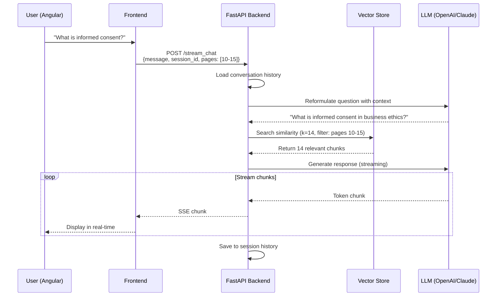
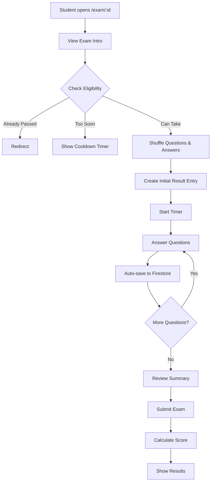

# Trainer-Teacher

Production-ready online examination platform built with **Angular 19** and **Firebase**. Features real-time exam delivery, auto-save progress tracking, and comprehensive admin dashboard for managing educational content.

## 🎯 What's Inside

This repository demonstrates a modern educational assessment system with:
- **Timed Exams**: Auto-save progress, resume capability, and intelligent question shuffling
- **AI-Powered Learning**: RAG-based chat system with context-aware responses and session persistence
- **Multi-Role System**: Admin dashboard for content management, student interface for learning and assessment
- **Real-time Persistence**: Firestore-backed automatic progress saving
- **Content Management**: Teachers (modules), Courses, and Exams with full CRUD

## 🧑‍🎓 User Roles

| Role | Capabilities | Routes |
|------|-------------|---------|
| **Admin** | Full CRUD on Teachers, Courses, Exams + Dashboard access | `/crud`, `/course-crud`, `/exam-crud`, `/main` |
| **Students** | View educational content, take exams, chat with AI teacher | `/teacher/:id`, `/exam/:id`, `/pdf-viewer` |

## 🎓 Key Features

### Exam Taking System
- **Smart Shuffling**: Questions and answers randomized per attempt
- **Live Progress Tracking**: Every answer auto-saved to Firestore
- **Resume Capability**: Interrupted exams continue with correct time calculation
- **Timer Management**:
  - Exam duration (`timeToDoTheExam`)
  - Retry cooldown (`timeToWait`)
- **Instant Results**: Pass/fail based on configurable `passingPercentage`

### Admin Dashboard
- **Teachers Management**: Educational modules with PDF content and section mapping
- **Courses Management**: Difficulty levels, date ranges, teacher assignments
- **Exams Management**: Multiple-choice questions with 2-6 answer options
- **Results Analytics**: Student performance tracking across exams

### Content Delivery
- PDF viewer for educational materials
- Section-based navigation with page mapping

---

## 🧠 Advanced Features: Intelligent RAG System

This platform integrates with a sophisticated **RAG (Retrieval-Augmented Generation)** backend for the Teacher chat interface, featuring several production-grade optimizations:

### Context-Aware Retrieval Architecture



### Key Optimizations

#### 1. Dynamic Page Filtering
Traditional RAG searches entire documents, leading to context noise. Our approach:

```python
# Smart filtering by current section
retriever = vector_store.as_retriever(
    search_kwargs={
        "k": 14,  # Top-14 most relevant chunks
        "filter": {
            "source": current_pdf_path,
            "page": {"$in": current_section_pages}  # Section-specific
        }
    }
)
```

**Impact**: When a student is in "Section 3" (pages 15-20), the system only searches those specific pages instead of the entire 100-page document. This results in:
- **~70% reduction** in irrelevant context retrieval
- Higher precision in answers
- Faster response times

#### 2. History-Aware Question Reformulation
The system uses an LLM to reformulate vague follow-up questions before retrieval:

```
User: "What is informed consent?"
AI: [retrieves context and responds]

User: "Can you give me an example?"
System internally reformulates to: "Can you give an example of informed consent in business ethics?"
[Then retrieves with the full context]
```

**Why this matters**: Maintains conversation continuity across multi-turn interactions without losing context.

#### 3. Streaming Response Architecture
- Real-time token-by-token response delivery via Server-Sent Events (SSE)
- Async FastAPI backend with LangChain streaming chains
- Better UX: Users see responses appear in real-time (ChatGPT-style)
- Optional Text-to-Speech: Toggle to enable voice playback of AI responses for accessibility and audio-based learning

#### 4. Session Persistence with Redis
- Conversation history stored in **Redis** with `${userUID}_${teacherId}` session keys
- Full message history (Human/AI pairs) persisted across sessions
- Survives page reloads, navigation, and server restarts
- Enables resuming learning sessions days later
- Fast retrieval (<10ms) for conversation context loading

### Production Safeguards

**Strict Context Adherence**:
```python
system_prompt = """
CRITICAL RULES:
1. ONLY use information from "Context:" section
2. If info not in context, respond: "I don't have that information..."
3. NEVER make up or infer information not in the documents
"""
```

**Special Learning Modes**:
- `"Just ask me 2 serious questions..."` → Quiz mode with 2 challenging questions
- `"Can you explain [topic]..."` → Detailed explanation with follow-up options
- Automatic difficulty adaptation based on student responses

### Technical Stack (Backend)
- **API Framework**: FastAPI (async, high-performance)
- **LLM Integration**: LangChain with OpenAI/Anthropic models
- **Vector Store**: Pinecone/Chroma with semantic search
- **Embeddings**: OpenAI text-embedding-3-small
- **Session Storage**: Redis (in-memory, <10ms retrieval)
- **Message History**: LangChain's `RedisChatMessageHistory` for conversation persistence

*Note: RAG backend implementation available in separate repository. Technical deep-dive available upon request.*

---

## 🛠️ Tech Stack
- **Framework:** Angular 19 (standalone components, signals)
- **Backend:** Firebase Authentication + Cloud Firestore
- **UI:** Angular Material + Tailwind CSS
- **i18n:** Transloco (English, Spanish, French)
- **Build:** Angular CLI 19 + Vite

## 🚀 Quick Start

### Prerequisites
```bash
# Node.js LTS (v22.x recommended)
node -v  # v22.20.0

# Angular CLI
npm install -g @angular/cli
```

### Environment Setup
1. Create Firebase project at [console.firebase.google.com](https://console.firebase.google.com)
2. Create environment files:

```typescript
// src/environments/environment.development.ts
export const environment = {
  BASEURL: 'your-firebase-api-url',
  BACK_CHAT_URL: 'your-backend-url',
  WEBSITE_NAME: 'Trainer Teacher',
  firebase: {
    apiKey: "your-api-key",
    authDomain: "your-project.firebaseapp.com",
    projectId: "your-project-id",
    storageBucket: "your-project.appspot.com",
    messagingSenderId: "your-sender-id",
    appId: "your-app-id"
  }
};
```

```typescript
// src/environments/environment.ts (production)
export const environment = {
  // Same structure as development
};
```

### Installation & Run
```bash
# Install dependencies
npm install

# Run development server
ng serve
# Navigate to http://localhost:4200

# Build for production
ng build
```

### Firebase Configuration
```bash
# Set default Firebase project
firebase use default

# Deploy to Firebase Hosting
firebase deploy
```

## 📁 Project Structure
```
src/app/
├── components/
│   ├── auth/                  # Login/register components
│   ├── chat/                  # Chat interface
│   ├── evaluation/            # Exam taking component
│   ├── left-menu/             # Navigation menu
│   ├── school/                # Dashboard components
│   │   ├── dashboard/
│   │   ├── exam-result-list/
│   │   ├── exams-list/
│   │   ├── student-list/
│   │   └── teacher-list/
│   ├── superadmin/            # CRUD components
│   │   ├── teachers-crud/
│   │   ├── course-crud/
│   │   └── exam-crud/
│   └── shared/                # Reusable components
├── guards/
│   ├── admin.guard.ts         # Admin access guard
├── models/
│   ├── exam.ts                # Exam, Question, Option
│   ├── result.ts              # Result, QuestionAndAnswer
│   ├── teacher.ts             # Teacher, Section
│   ├── course.ts
│   ├── user.ts
│   └── student.ts
├── pages/
│   ├── mainselector-page/     # Landing page
│   ├── school-main-page/      # Admin dashboard
│   └── teacher-main-page/     # Teacher content page
├── services/
│   ├── auth.service.ts        # Firebase authentication
│   ├── exam.service.ts        # Exam queries
│   ├── exam-crud.service.ts   # Exam CRUD operations
│   ├── result.service.ts      # Result tracking
│   ├── teacher-crud.service.ts
│   ├── course-crud.service.ts
│   └── user.service.ts
└── app.routes.ts              # Route configuration
```

## 🎮 Exam Flow



## 🔐 Authentication & Guards

### Admin Guard
```typescript
// Protects /crud, /course-crud, /exam-crud routes
if (user && user.email === 'martin@martin.com') {
  return true; // Admin access
}
```


## 📊 Data Models

### Exam Structure
```typescript
interface Exam {
  id: string;
  title: string;
  questions: Question[];
  passingPercentage: number;     // e.g., 70
  timeToWait: number;             // Minutes before retry
  timeToDoTheExam: number;        // Exam duration in minutes
  recruiterId?: string;
}

interface Question {
  text: string;
  options: Option[];              // 2-6 options
}

interface Option {
  text: string;
  isCorrect: boolean;             // Only one correct per question
}
```

### Result Tracking
```typescript
interface Result {
  userUID: string;
  examId: string;
  doingTheExamNow: boolean;       // Resume flag
  momentStartExam: string;        // ISO timestamp
  questions_answered: number;
  correctAnswers: number;
  examPassed?: boolean;
  questions: QuestionAndAnswer[]; // Saved answers
}
```

## 🌐 i18n Support

Transloco configuration with 3 languages:
```typescript
availableLangs: ['en', 'es', 'fr']
defaultLang: 'en'
```

Translation files in `/public/i18n/`:
- `en.json`
- `es.json`
- `fr.json`

## 🚢 Deployment

### Firebase Hosting
```bash
# Build production bundle
ng build

# Deploy to Firebase
firebase deploy
```

### Environment Configuration
- **Development**: Uses `environment.development.ts`
- **Production**: Uses `environment.ts`

Configured in `angular.json`:
```json
{
  "configurations": {
    "production": {
      "outputHashing": "all"
    },
    "development": {
      "optimization": false,
      "sourceMap": true,
      "fileReplacements": [{
        "replace": "src/environments/environment.ts",
        "with": "src/environments/environment.development.ts"
      }]
    }
  }
}
```

## 🔑 Key Architectural Patterns

### Standalone Components
```typescript
@Component({
  selector: 'app-exam',
  imports: [CommonModule, MatIconModule],
  standalone: true
})
```

### Reactive Signals
```typescript
currentUserSig = signal<User | null>(null);
// Auto-updates components on change
```

### Firebase Integration
```typescript
// Real-time data streams
exams$ = collectionData(examCollection) as Observable<Exam[]>;
```

### Guard-based Security
```typescript
{
  path: 'crud',
  component: TeachersCRUDComponent,
  canActivate: [adminGuard]
}
```

## 📖 Learning Path

1. **Setup**: Configure Firebase and environment files
2. **Explore**: Navigate the main selector and dashboard
3. **Take Exam**: Experience the student workflow at `/exam/:id`
4. **Admin Panel**: Access CRUD operations (requires admin email)
5. **Customize**: Modify exam settings, questions, and content

## 🎯 Production Features

- ✅ **Auto-save Progress**: Never lose exam answers
- ✅ **Resume Capability**: Continue interrupted exams
- ✅ **Time Management**: Accurate timer with resume support
- ✅ **Anti-cheat**: Question/answer shuffling
- ✅ **Cooldown System**: Prevent immediate retakes
- ✅ **Role-based Access**: Secure admin operations
- ✅ **Multi-language**: English, Spanish, French

## 🤝 Contributing

This is an educational platform template. Feel free to fork and adapt for your use case.

## 📝 License

MIT License - see LICENSE file for details

---

**Built with ❤️ using Angular 19, Firebase, and modern web standards**
